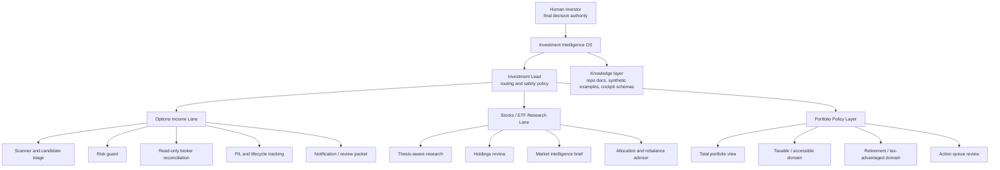

# Investment Intelligence OS Portfolio

## TL;DR

This repository is a public, sanitized portfolio of an investment intelligence operating system: agent architecture, research workflows, options-income scanning patterns, account-domain allocation logic, broker read-only boundaries, and human-reviewed decision support.

It is not a trading bot, not financial advice, and not a mirror of the private Investment OS repository. It is a museum exhibit: structured enough to show the system, sanitized enough to be safe in public.

The design principle is simple:

> Research, summarize, reconcile, and prepare. Do not execute.

This repo documents the investment intelligence domain of a broader multi-domain agentic OS designed around Hermes runtime orchestration, durable repo contracts, human approval gates, and explicit safety boundaries.

## What This Demonstrates

- Multi-agent investment workflow design.
- Research-first stock and ETF analysis.
- Options-income scanner and triage architecture.
- Broker read-only reconciliation boundaries.
- Account-domain reasoning across taxable and tax-advantaged accounts.
- Human review gates before any financial action.
- Repo-backed documentation, synthetic examples, and audit-friendly outputs.
- Executable synthetic code that demonstrates scanner and notification logic without touching real accounts.

## System Map

## Featured Artifacts

- [About The System](ABOUT.md) - why this exists and what it is meant to prove.
- [Portfolio Map](docs/portfolio-map.md) - how the private Investment OS maps into this public repo.
- [Agent Architecture](docs/agent-architecture.md) - sanitized lead/options/stocks/portfolio agent hierarchy.
- [Options Income Workflow](docs/options-income-workflow.md) - scanner, triage, risk, reconciliation, and lifecycle model.
- [Stock Research Workflow](docs/stock-research-workflow.md) - thesis-aware research, holdings review, and rebalance planning.
- [Account Domain Policy](docs/account-domain-policy.md) - taxable vs tax-advantaged allocation reasoning.
- [Broker Integration Boundaries](docs/broker-integration-boundaries.md) - read-only first, no credentials, no autonomous execution.
- [Cockpit And Status Model](docs/cockpit-and-status-model.md) - sanitized Notion and dashboard operating model.
- [AI Toolchain](docs/ai-toolchain.md) - LLM and runtime layers used to build and operate the system.
- [Public Sanitization Standard](docs/public-sanitization.md) - what is safe to publish and what is not.
- [What I Am Building](show-us-what-im-building.md) - a concise application/interview-ready explanation.
- [System Diagram](diagrams/investment-intelligence-os.mmd) - standalone Mermaid source.

## Synthetic Examples

- [Synthetic Holdings Snapshot](examples/synthetic-holdings-snapshot.json)
- [Options Candidate Packet](examples/options-candidate-packet.md)
- [Broker Reconciliation Packet](examples/broker-reconciliation-packet.md)
- [Stock Research Brief](examples/stock-research-brief.md)
- [Account-Domain Rebalance Plan](examples/account-domain-rebalance-plan.md)
- [Cockpit Status Example](examples/cockpit-status-example.json)

## Executable Demo

- [Synthetic Options Scanner](src/investment_intelligence_demo/synthetic_options_scanner.py) - small Python module that scores synthetic options-income candidates and emits review packets.
- [Notification Formatter](src/investment_intelligence_demo/notification_formatter.py) - formats scanner output into a review message without creating an order.
- [Unit Tests](tests/test_synthetic_options_scanner.py) - stdlib tests for scanner/risk/formatter behavior.

## Private Source Represented

This public portfolio is derived from sanitized architecture and workflow patterns in a private `investment-os` repository. The private system contains operational code, account-specific workflow state, broker/API integration details, and active personal investment context that are intentionally not published here.

## Safety Statement

The private system treats broker execution as a separate, gated capability requiring explicit promotion and human approval. This public repo does not include live broker code, credentials, real holdings, account values, or trade instructions.
