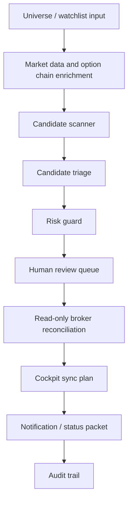

# Options Income Workflow

## TL;DR

The options-income lane is a governed workflow for scanning, triaging, reconciling, and monitoring options-income candidates. It is designed around review and lifecycle tracking, not autonomous execution.

## Workflow Shape



## Candidate Evaluation

A candidate packet can include:

- Strategy type.
- Underlying and expiration window.
- Credit/debit estimate.
- Max risk estimate.
- Liquidity checks.
- DTE bucket.
- Probability/risk indicators.
- Existing exposure check.
- Assignment/ownership caveat when relevant.
- Human-readable reason for watch/deploy/reject classification.

## Lifecycle Model

| State | Meaning |
|---|---|
| Draft candidate | Scanner found a possible setup. |
| Watch | Setup is interesting but not action-ready. |
| Review required | Human needs to inspect risk, account fit, or broker state. |
| Tracked manually | Human entered or adjusted a position outside the scanner's exact plan. |
| Broker-adopted variant | Broker truth differs from original scanner row but maps to a related manual variant. |
| Closed | Position lifecycle is complete and eligible for realized P/L summary. |
| Stale / archived | Local row no longer maps to active broker or review state. |

## Safety Boundary

The public pattern is:

```text
scan -> triage -> reconcile -> summarize -> ask for review
```

Not:

```text
scan -> trade
```

## What This Demonstrates

- Options workflow modeling.
- Human-in-the-loop decision design.
- Lifecycle reconciliation.
- Risk-first review queues.
- The difference between analysis automation and broker execution.
