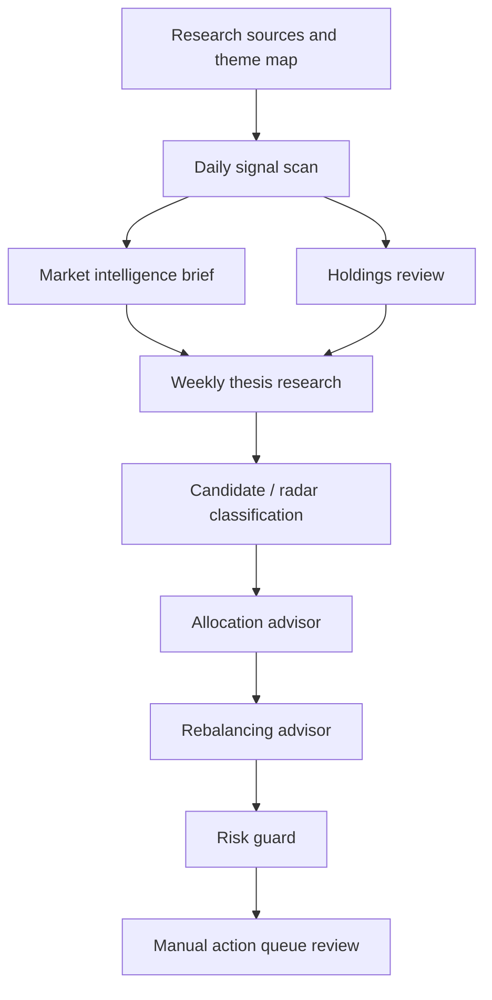

# Stock Research Workflow

## TL;DR

The stock/ETF lane is a thesis-aware research workflow. It monitors signals, reviews holdings, surfaces candidates, prepares allocation context, and produces manual rebalance plans. It does not trade.

## Workflow Shape

## Research Classifications

| Classification | Meaning |
|---|---|
| Portfolio Action | Evidence is strong enough to prepare a human-reviewed action idea. |
| Thesis Relook | A holding or thesis node needs deeper review. |
| Candidate Review | A potential new or replacement holding deserves structured research. |
| Watchlist / Radar | Interesting enough to track, not enough to act. |
| Interesting But Not Investable Yet | Useful signal, weak current actionability. |

## Research Lenses

The private system uses specialist lenses inside the researcher rather than making each lens a separate public agent. Examples include:

- AI compute infrastructure.
- Semiconductors and advanced packaging.
- Networking, optics, and interconnect.
- Power, grid, cooling, and thermal systems.
- Materials and supply chains.
- Robotics and automation.
- Frontier science and biotech.
- Macro, valuation, and risk.
- Skeptic / red-team review.

## Rebalance Discipline

The rebalancing advisor is downstream of research. It should not invent a buy list. It consumes evidence and produces a manual plan with:

- Account domain.
- Funding source.
- Target dollars.
- Approximate shares.
- Thesis rationale.
- Risk notes.
- Skip/hold-cash rationale.
- Pre-execution checks.

## What This Demonstrates

- Research workflow architecture.
- Thesis-aware classification.
- Separation of signal, research, allocation, and action.
- Account-aware decision support.
- Human review before any financial action.
